# Cloud-Project-Hosting-WordPress-on-AWS
🚀 Project Overview

This project demonstrates how to deploy a WordPress site on AWS using EC2, RDS, and VPC. It simulates a real-world cloud deployment scenario, showcasing my ability to:

Set up cloud infrastructure on AWS

Manage web servers

Configure and deploy WordPress for professional use

| Component  | Technology     | Description                                                     |
| ---------- | -------------- | --------------------------------------------------------------- |
| Hosting    | ☁️ AWS EC2     | Virtual server to host WordPress                                |
| Database   | 🗄️ AWS RDS     | Managed MySQL database for storing WordPress data               |
| Web Server | 🌐 Apache      | Handles HTTP requests and serves the WordPress site             |
| Backend    | ⚙️ PHP & MySQL | Power the dynamic content of WordPress                          |
| CMS        | 🎨 WordPress   | Content management system for building and managing the website |

# 📌 Architecture Overview
[User Browser] <---> [AWS EC2 (Apache + PHP + WordPress)] <---> [AWS RDS (MySQL Database)]
                   |
                   +--> [VPC for networking & security]

                   

# Key Points:

EC2 instance hosts WordPress application

RDS instance stores WordPress database

VPC provides secure networking

# 📸 Screenshots

| Step | Description                                                                                           | Screenshot                                                                               |
| ---- | ----------------------------------------------------------------------------------------------------- | ---------------------------------------------------------------------------------------- |
| 1    | **Architecture Overview:** Shows the architecture of WordPress hosted on AWS using EC2, RDS, and VPC. | 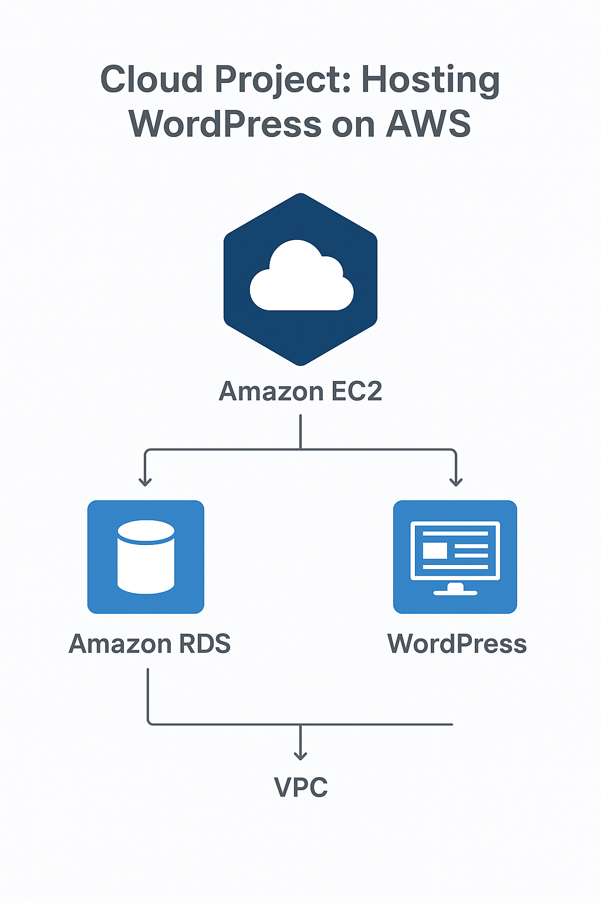                    |
| 2    | **AWS WordPress Architecture Diagram:** High-level diagram of all AWS components used.                | 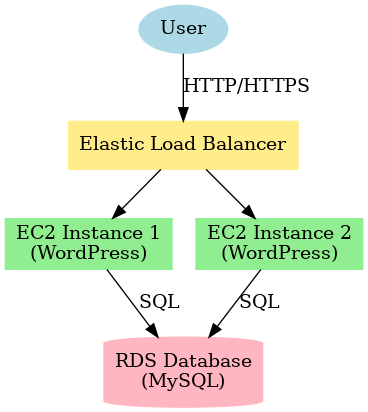 |
| 3    | **Connect to EC2 Instance:** SSH connection to the EC2 instance where WordPress will be installed.    | 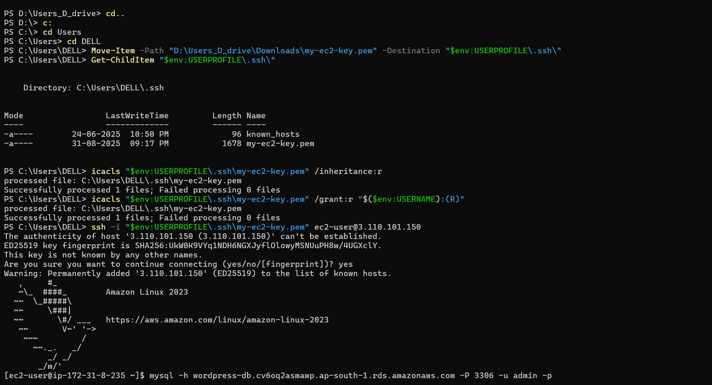                |
| 4    | **Create Database for WordPress:** Setup RDS or MariaDB database for WordPress.                       | 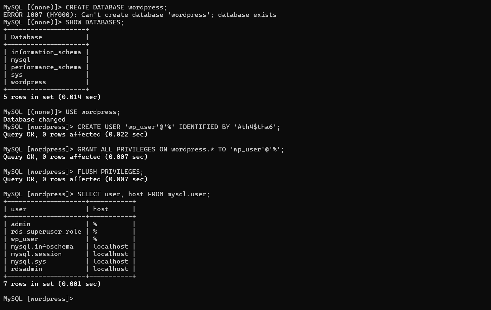                   |
| 5    | **Download WordPress:** Download the latest WordPress package on EC2 instance.                        | 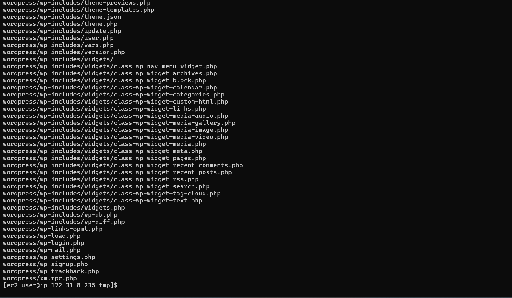               |
| 6    | **Install MariaDB 10.5 (Part 1):** Initial setup commands for database installation.                  | 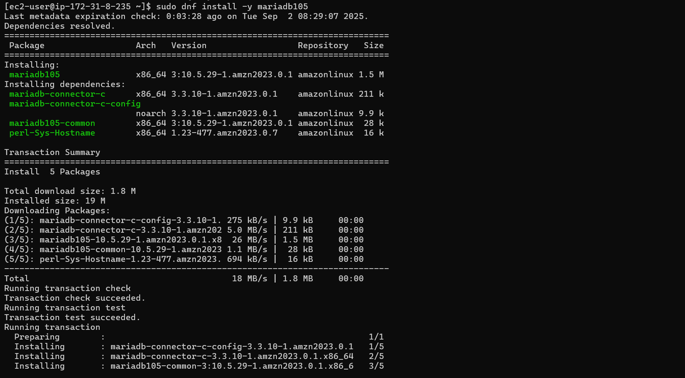         |
| 7    | **Install MariaDB 10.5 (Part 2):** Continue MariaDB setup and configuration.                          | 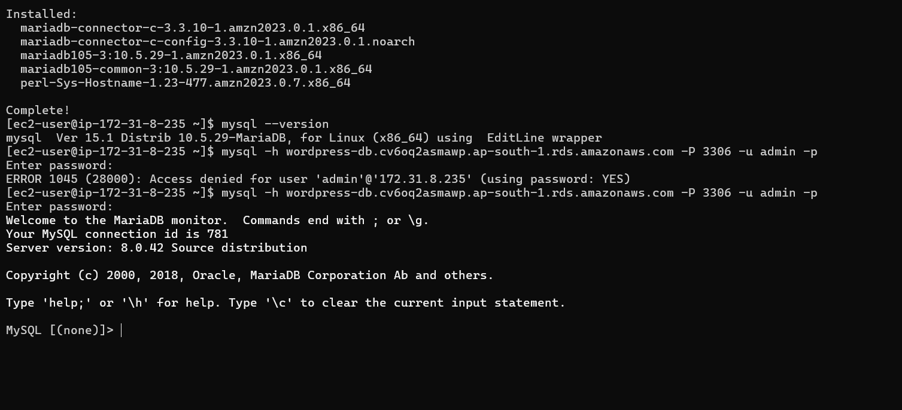         |
| 8    | **EC2 Instance Overview:** Shows the running EC2 instance hosting WordPress.                          | 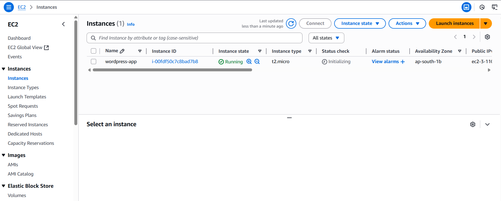                        |
| 9    | **Replace DB Details in wp-config.php:** Configure WordPress to connect to the database.              | 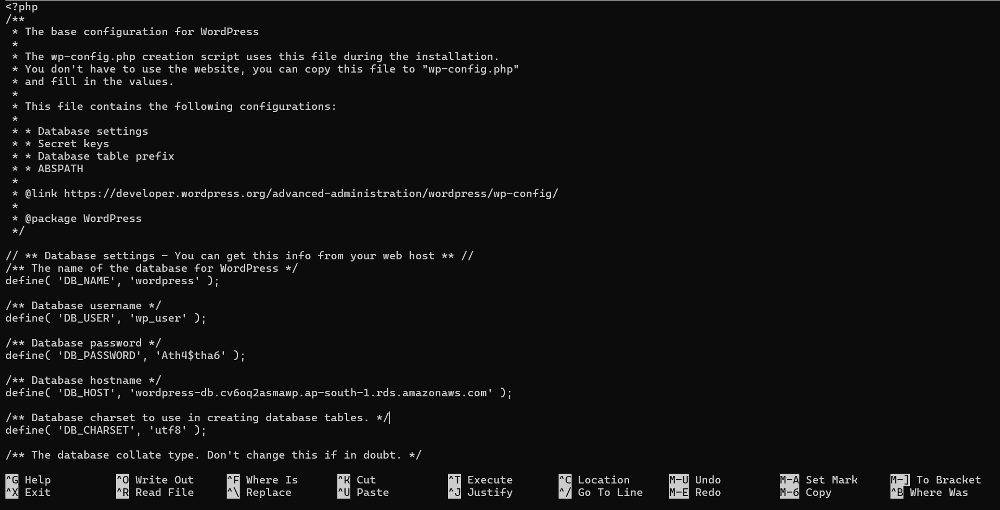         |
| 10   | **Run WordPress in Browser:** Access WordPress site via EC2 public IP.                                | 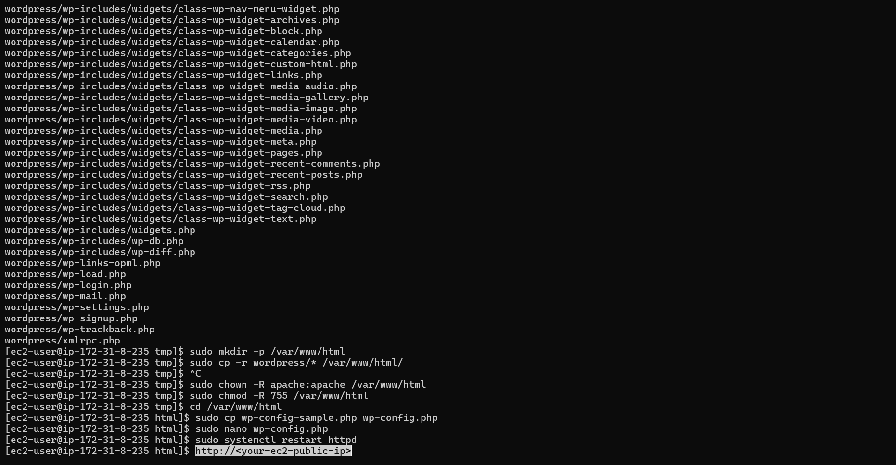            |
| 11   | **Initial WordPress Setup Screenshot:** Screenshot of WordPress setup page in browser.                |           |
| 12   | **Homepage Preview 1:** First view of the deployed WordPress site.                                    | 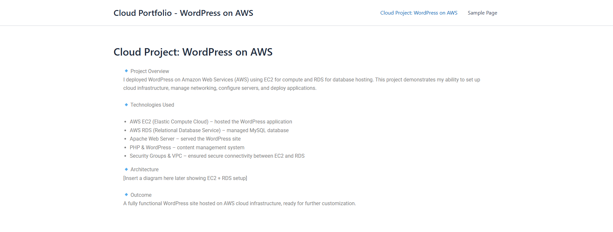                      |
| 13   | **Homepage Preview 2:** Alternate view of WordPress homepage.                                         | 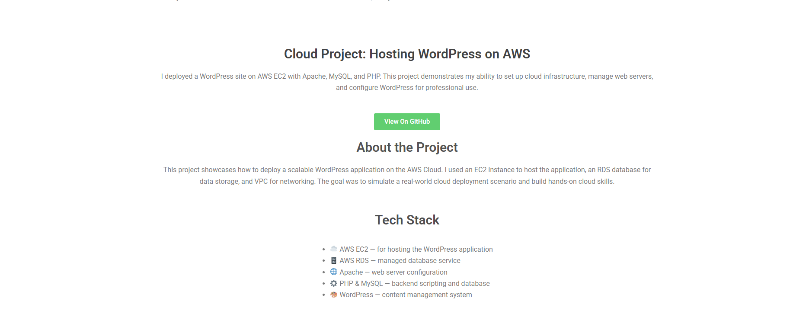                      |
| 14   | **Homepage Preview 3:** Additional view for reference.                                                | 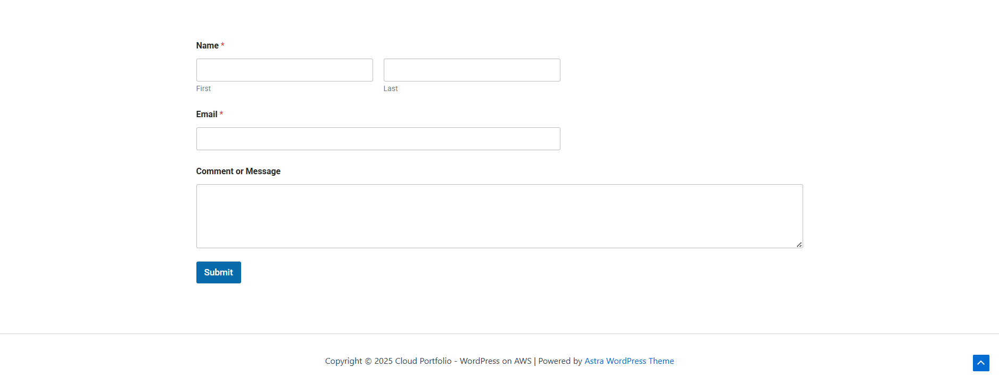                      |
| 15   | **Security Groups Overview:** Shows security groups configured for EC2 and RDS.                       | 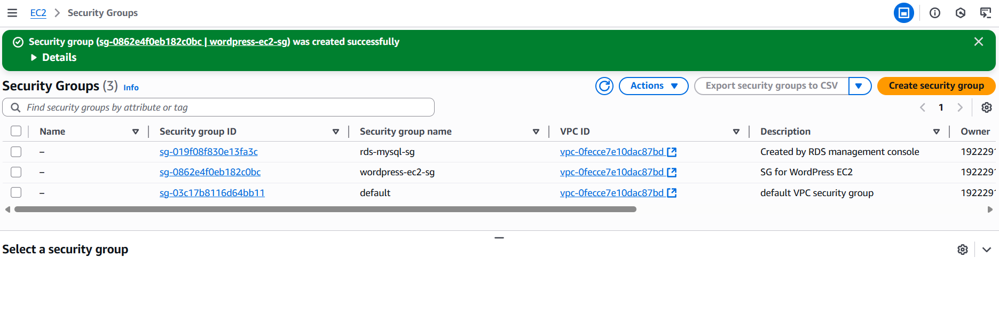                       |
| 16   | **Updated Security Rules:** Modified security rules to allow HTTP/HTTPS traffic.                      | 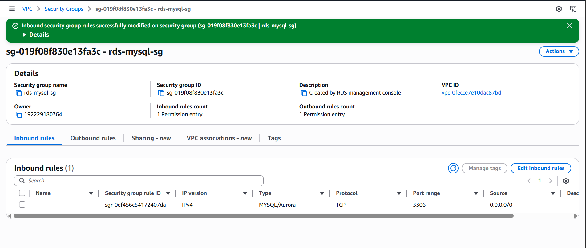         |
| 17   | **WordPress Dashboard:** Admin dashboard after logging into WordPress.                                | 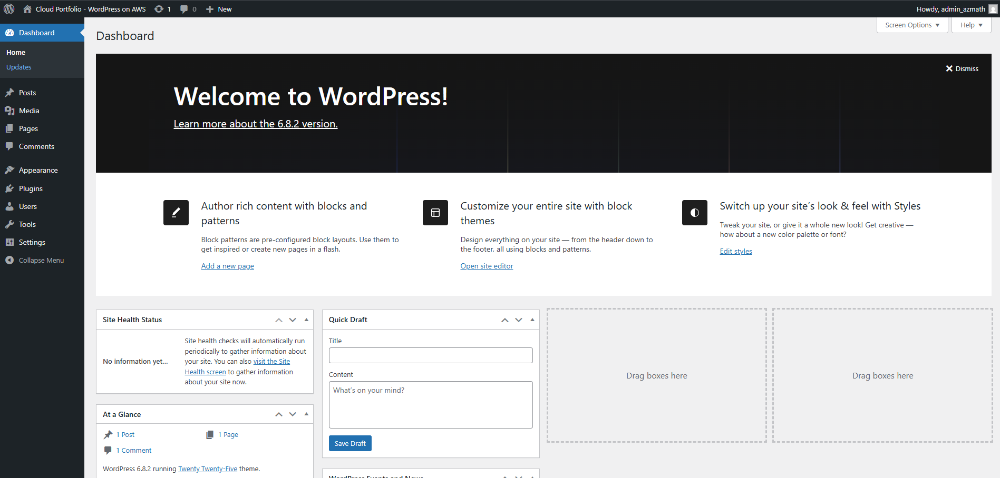               |
| 18   | **WordPress Running in Browser:** Final live website screenshot.                                      | 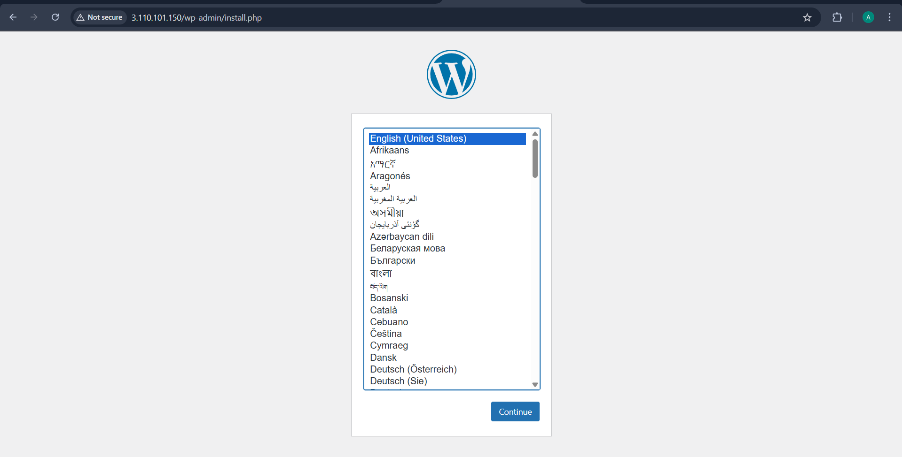        |

# 📖 How to Deploy 

Launch an EC2 instance with Amazon Linux or Ubuntu.

Install Apache, PHP, and other dependencies:

sudo yum update -y
sudo yum install httpd php php-mysqlnd -y
sudo systemctl start httpd
sudo systemctl enable httpd

Launch an RDS MySQL instance and note the endpoint.

Configure WordPress to connect to the RDS database.

Update security groups to allow HTTP/HTTPS access.

Test the website by visiting your EC2 public IP or domain.

# 📬 Contact Me

If you have questions or want to discuss this project, feel free to reach out:

# Author
Name : Azmath Patel
LinkedIn: [Connect with me on LinkedIn](https://www.linkedin.com/in/azmath-patel-software-engineer/)

# Additional Projects

Github repository link: [Aws Cloudfront Static Website](https://github.com/Azmath-Patel/aws-cloudfront-static-website/tree/main)

